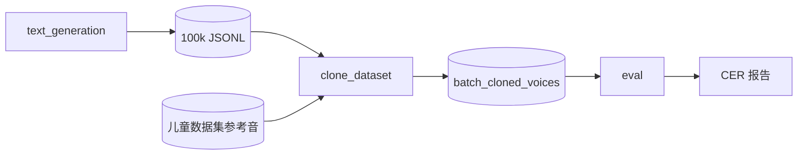

# 批量文本生成与儿童语音克隆流水线

**LLM 生成儿童口语文本 → 数据集参考音批量克隆 → ASR + 两阶段 ITN + 字级 CER 评测**

## 目录结构

```
batch_generate_text_and_clone/
├── README.md                 # 本总览
├── clone_dataset.py          # 批量克隆（每条参考音随机 10 句）
├── run_clone_8workers.sh     # 双卡 8 worker 启动
├── text_generation/          # ① 文本生成 → text_generation/README.md
└── eval/                     # ② 评测     → eval/README.md
```

克隆输出默认在仓库根目录 `batch_cloned_voices/`（`text_*.wav` + `text_*.json`）。

## 快速开始

### ① 生成文本

```bash
# 配置 text_generation/.env（LLM_API_KEY、LLM_BASE_URL、LLM_MODEL）
python batch_generate_text_and_clone/text_generation/run_100k_asr_complete.py
```

产出：`batch_generated_text/llm_children_100k_asr_complete.jsonl`

详见 **[text_generation/README.md](text_generation/README.md)**

### ② 批量克隆

```bash
# 调试：单 worker、2 条参考音
python batch_generate_text_and_clone/clone_dataset.py \
  --gpu 0 --worker-id 0 --num-workers 1 --limit 2

# 生产：双 GPU × 4 worker
bash batch_generate_text_and_clone/run_clone_8workers.sh
```

每条参考音随机抽 10 句 JSONL 文本，写入：

```
batch_cloned_voices/{数据集}/{说话人}/text_001.wav
batch_cloned_voices/{数据集}/{说话人}/text_001.json   # gen_text = 克隆用原文
```

### ③ 评测克隆质量

```bash
conda activate omnivoice
cd batch_generate_text_and_clone/eval
# 配置 eval/.env：ITN_LLM_API_KEY、ITN_LLM_BASE_URL、ITN_LLM_MODEL

# 固定 200 条对比 Manual vs LLM ITN
python eval_batch_200.py

# 全库评测 + 逐条 .eval.json
python eval_cloned.py
```

详见 **[eval/README.md](eval/README.md)**

## 流水线



## 选用哪个评测脚本？

| 需求 | 脚本 |
|------|------|
| 固定 200/500 条、可复现；迭代 LLM ITN | `eval/eval_batch_200.py` |
| 全库扫描、写 `text_*.eval.json` | `eval/eval_cloned.py` |

两个脚本使用**同一套**评测流水线（Qwen3-ASR 全段识别 → Manual ITN → LLM ITN → 字级 CER），区别仅在于样本范围与输出命名。

## 环境与路径

| 项目 | 说明 |
|------|------|
| 文本生成 API | `text_generation/.env` 或 `LLM_API_KEY` / `DEEPSEEK_API_KEY` |
| LLM ITN API | `eval/.env`（`ITN_LLM_*`） |
| 评测 conda | `omnivoice`（Qwen3-ASR、jiwer 等） |
| 默认路径 | 脚本内常量指向本仓库；换环境请改源码或环境变量 |

勿将 `.env` 中的 API Key 提交到 Git。

## 子模块文档

- **[text_generation/README.md](text_generation/README.md)** — LLM 生成、去重质检、JSONL 格式、`text_tn`
- **[eval/README.md](eval/README.md)** — ASR/ITN 流程、CLI、缓存、输出文件说明
