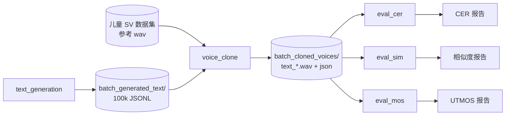

# 批量文本生成与儿童语音克隆流水线

**LLM 生成儿童口语文本 → 参考音批量克隆 → CER / 相似度 / UTMOS 三类评测**

本目录是 OmniVoice 儿童语音克隆实验的端到端工具链：从文本池生成、多 GPU 批量克隆，到三类独立评测（内容 / 音色 / 自然度）。

## 目录结构

```
batch_generate_text_and_clone/
├── README.md                    # 本总览
├── text_generation/             # ① LLM 生成 10 万条儿童口语文本
├── voice_clone/                 # ② 多 GPU 批量克隆
├── eval_cer/                    # ③ 字级 CER 评测（ASR + 确定性规则 TN）
├── eval_sim/                    # ④ 说话人相似度评测（samresnet100）
├── eval_mos/                    # ⑤ UTMOS 自然度评测（omnivoice/eval）
└── filter_cloned.py             # ⑥ 按 CER / raw cosine 严格筛选
```

各子目录均有独立 README，详见文末链接。

## 数据流



### 关键路径（默认）

| 阶段 | 输入 | 输出 |
|------|------|------|
| 文本生成 | LLM API | `batch_generated_text/llm_children_100k_asr_complete.jsonl` |
| 语音克隆 | JSONL + 4 个儿童 SV 数据集参考音 | `$CLONED_VOICES_ROOT/{数据集}/.../text_*.wav` |
| CER 评测 | 克隆 wav + sidecar `gen_text` | `batch_cloned_voices/eval_*` + `text_*.eval.json` |
| 相似度评测 | 克隆 wav + sidecar `ref_audio` | `batch_cloned_voices/eval_sim_*` + `text_*.sim.json` |
| 质量评测 (多指标) | 克隆 wav | `batch_cloned_voices/eval_summary*` + `text_*.mos.json` |

## 环境一览

| 阶段 | Conda 环境 | 外部依赖 |
|------|-----------|----------|
| text_generation | 任意 Python 3.10+ | LLM API（`.env`） |
| voice_clone | **omnivoice** | OmniVoice checkpoint、GPU |
| eval_cer | **qwen3-asr** | Qwen3-ASR 本地模型；TN 为纯本地确定性规则，不需要 LLM/API |
| eval_sim | **omnivoice** | GPU；模型权重在 `eval_sim/model/` |
| eval_mos | **omnivoice** | GPU；UTMOS 权重在 `TTS_eval_models/mos/` |

文本生成阶段仍可能使用 `.env` 中的 API Key，请勿提交到 Git；CER 阶段不读取 LLM API 配置。

## 快速开始（全流程）

### ① 生成文本

```bash
cd batch_generate_text_and_clone/text_generation
# 配置 .env：LLM_API_KEY、LLM_BASE_URL、LLM_MODEL
python run_100k_asr_complete.py
```

→ 详见 [text_generation/README.md](text_generation/README.md)

### ② 批量克隆

```bash
conda activate omnivoice
cd /root/code/github_repos/OmniVoice-fork

# 调试：单 worker、2 条参考音
python batch_generate_text_and_clone/voice_clone/clone_dataset.py \
  --gpu 0 --worker-id 0 --num-workers 1 --limit 2

# 生产：默认 8 GPU × 1 worker；可用 GPUS / WORKERS_PER_GPU 调整
bash batch_generate_text_and_clone/voice_clone/run_clone_8workers.sh
```

→ 详见 [voice_clone/README.md](voice_clone/README.md)

### ③ CER 评测（内容正确性）

```bash
conda activate qwen3-asr
cd batch_generate_text_and_clone/eval_cer

python eval_batch_200.py      # 固定 200 条，日常迭代
python eval_cloned.py         # 全库 + 逐条 .eval.json
```

→ 详见 [eval_cer/README.md](eval_cer/README.md)

### ④ 说话人相似度（克隆 vs 原音）

```bash
conda activate omnivoice
cd batch_generate_text_and_clone/eval_sim
bash run_eval.sh
# 或: GPU=0 SAMPLE_SIZE=200 bash run_eval.sh
```

→ 详见 [eval_sim/README.md](eval_sim/README.md)

### ⑤ UTMOS 自然度（听感质量）

```bash
conda activate omnivoice
cd batch_generate_text_and_clone/eval_mos
bash run_eval.sh
# 或: GPU=0 SAMPLE_SIZE=200 bash run_eval.sh
```

→ 详见 [eval_mos/README.md](eval_mos/README.md)

### 全库三类评测（CER → SIM → MOS，tmux 后台）

```bash
bash batch_generate_text_and_clone/run_eval_all.sh   # 自动创建 tmux session eval_all
tmux attach -t eval_all                              # 查看进度
tail -f "$CLONED_VOICES_ROOT/logs/eval_all/cer.log"  # 或单独看某阶段日志
```

默认顺序：**CER → SIM → MOS**；CER 与 SIM 默认串行并使用分离的 GPU 配置。`--skip-existing`
只复用通过当前音频、模型和指标契约校验的 sidecar，canonical aggregate 会从 sidecar 原子重建。

### ⑥ 严格筛选

```bash
python batch_generate_text_and_clone/filter_cloned.py \
  --out-dir "$CLONED_VOICES_ROOT" \
  --max-cer 0.1 --min-sim 0.8 \
  --output "$CLONED_VOICES_ROOT/filtered/cer_lt0.1_sim_gt0.8.txt"
```

`--min-sim` 使用原始余弦相似度 `[-1, 1]`，默认阈值为 `0.8`。筛选默认要求 CER/SIM 对当前 clone inventory
达到 100% 覆盖，并为结果列表写同名 `.manifest.json`；仅调试局部结果时才使用 `--allow-partial`。

需要按 CER/SIM 分类并复制到 accepted root 时，先运行 `prune_and_copy.py` 查看预览；只有复核统计后显式加
`--execute` 才会删除 raw round 中的失败项并复制通过项。默认不再修改任何音频。

## 选用哪个脚本？

### 克隆

| 场景 | 命令 |
|------|------|
| 本地调试 | `clone_dataset.py --limit N --num-workers 1` |
| 全量生产 | `run_clone_8workers.sh`（默认 8 worker；按当前 v2/v3 sidecar 契约安全续跑） |

### 评测

| 需求 | 脚本 | 指标 |
|------|------|------|
| 固定 200/500 条、迭代规则 TN | `eval_cer/eval_batch_200.py` | 确定性字级 CER v4 |
| 全库 CER、写 sidecar | `eval_cer/eval_cloned.py` | 字级 CER |
| 克隆音 vs 原音音色 | `eval_sim/eval_clone_similarity.py` | 原始余弦相似度 [-1,1] |
| 克隆音自然度 | `eval_mos/eval_clone_mos.py` | UTMOS [1,5] |

CER、相似度、UTMOS 评测**相互独立**，可并行跑；共用同一批 `batch_cloned_voices/` 输出。

## Sidecar 约定（`text_*.json`）

克隆脚本为每条 wav 写 sidecar，供两类评测读取：

```json
{
  "schema_version": 3,
  "status": "generated",
  "plan_id": "...",
  "round_id": "20260720_r01",
  "task_id": "...",
  "speaker_key": "dataset/speaker",
  "ref_audio": "/path/to/original.wav",
  "ref_text": "原参考句",
  "gen_text": "克隆用 LLM 文本（CER 参考）",
  "cloned_audio": "/path/to/text_001.wav",
  "ref_audio_signature": {"size": 12345, "mtime_ns": 123456789},
  "cloned_audio_signature": {"size": 67890, "mtime_ns": 123456999},
  "speed": 1.12,
  "language": "zh",
  "model": "/path/to/checkpoint",
  "generated_at": "2026-05-27T15:20:03"
}
```

plan 模式写 schema v3 和上述计划身份字段；兼容的旧 dataset-scan 模式继续写 schema v2。

| 字段 | eval_cer | eval_sim | eval_mos |
|------|----------|----------|----------|
| `gen_text` | ASR 参考文本 | — | — |
| `ref_audio` | — | 原说话人 wav | — |
| `cloned_audio` / `text_*.wav` | ASR 输入 | 克隆 wav | 克隆 wav |
| `status=generated` | 仅评测成功克隆 | 同左 | 同左 |

## 常见问题

**克隆中断了怎么办？**  
重新启动同一 launcher 即可。完整、身份和签名一致的输出会跳过；`generating`、partial、corrupt、
failed 会按 `--max-attempts` 恢复或明确标记失败，不会被评估扫描器当作成功样本。

**CER、相似度、UTMOS 该看哪个？**  
- CER 低 → 克隆内容读对了  
- 相似度高 → 音色接近原说话人  
- UTMOS 高 → 听感更自然  
三者需结合业务需求判断。

**换机器 / 换路径？**  
各脚本顶部有路径常量（`DATASETS`、`MODEL_PATH`、`OUT_ROOT` 等），按环境修改；或通过环境变量（如 `CLONED_VOICES_ROOT`）覆盖部分默认值。

## 子模块文档

- **[text_generation/README.md](text_generation/README.md)** — LLM 生成、去重质检、JSONL 格式
- **[voice_clone/README.md](voice_clone/README.md)** — 多 GPU 克隆、worker 分配、输出结构
- **[eval_cer/README.md](eval_cer/README.md)** — 无 LLM 的确定性规则 TN、CER v4 缓存与报告
- **[eval_sim/README.md](eval_sim/README.md)** — samresnet100 相似度、与 wespeaker 对齐说明
- **[eval_mos/README.md](eval_mos/README.md)** — UTMOS 自然度（omnivoice/eval）
