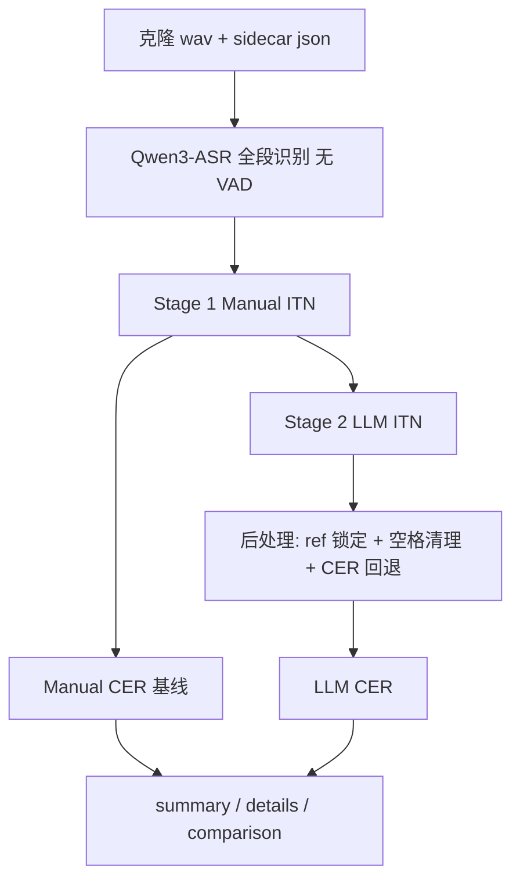

# 克隆语音 CER 评测（eval_cer）

对 `batch_cloned_voices/` 下的克隆音频做 **全段 ASR → 两阶段 ITN → 字级 CER** 评测，对比 Manual ITN 与 LLM ITN 效果，衡量克隆内容是否「读对了」。

> 音色相似度请用 **[eval_sim](../eval_sim/README.md)**，自然度请用 **[eval_mos](../eval_mos/README.md)**；本目录只评文本正确性。

## 目录

```
eval_cer/
├── README.md              # 本文档
├── .env                   # LLM ITN API（勿提交 Git）
├── eval_batch_200.py      # 固定 N 条样本、可复现对比（推荐日常跑分）
├── eval_cloned.py         # 全库扫描、逐条写 .eval.json
└── eval_sample_{N}.json   # 首次运行 eval_batch_200 时自动生成
```

## 环境

```bash
conda activate omnivoice
cd batch_generate_text_and_clone/eval_cer
```

| 依赖 | 说明 |
|------|------|
| Qwen3-ASR | 本地默认 `~/.cache/huggingface/hub/Qwen3-ASR-1.7B-local` |
| jiwer | 字级 CER |
| LLM ITN API | `eval_cer/.env` 中 `ITN_LLM_*` |
| torch / torchaudio | ASR 推理 |

### `.env` 示例

```bash
ITN_LLM_MODEL=deepseek-v4-flash
ITN_LLM_API_KEY=sk-...
ITN_LLM_BASE_URL=https://your-api/v1
```

也支持 `LLM_API_KEY` / `LLM_BASE_URL` / `LLM_MODEL` 作为回退。

## 评测流程



### Stage 1 — Manual ITN

对 ref（sidecar 的 `gen_text`）与 ASR 假设依次：

1. 去掉 OmniVoice 非语言标签（`[laughter]` 等）
2. 数字/单位/分数/中文数字等规则归一化（复用 `text_generation/llm_generate_texts.py` 中规则）
3. 去标点、小写、合并多余空白（**保留词间空格**）

### Stage 2 — LLM ITN

- **输入**：Manual ITN 预处理后的 `ref_manual_prep` / `hypo_manual_prep`
- **目的**：补 Manual 未覆盖的同音字、拼音、公式、中英混读对齐等
- **后处理**（`llm_itn_postprocess`）：
  - ref **固定为** `ref_manual`，不让 LLM 改参考文本
  - 清理 CJK↔拉丁多余空格
  - 若 `CER(ref, hyp_llm) > CER(ref, hyp_manual)`，回退到 Manual hyp

### 指标

- **字级 CER**（`jiwer.process_characters`），非词级 WER
- 汇总 **Weighted CER**（按 ref 字符数加权）

## 脚本对比

| 脚本 | 适用场景 | 样本 | 输出位置 |
|------|----------|------|----------|
| `eval_batch_200.py` | 固定子集、迭代 ITN、对比 Manual/LLM | `--sample-size`（默认 200） | `batch_cloned_voices/eval_*_{N}.*` |
| `eval_cloned.py` | 全库正式评测 | 所有 `text_*.wav` | `batch_cloned_voices/eval_*.*` + `text_*.eval.json` |

两者共用 `eval_batch_200.py` 中的 ASR / ITN / 报告函数，流水线一致。

## 快速开始

### 固定 200 条（日常对比）

```bash
# 首次：ASR + LLM（会生成 eval_sample_200.json）
python eval_batch_200.py

# 仅重跑 LLM（ASR 走缓存）
python eval_batch_200.py --skip-asr --refresh-llm-cache

# 500 条（seed=43，输出 eval_*_500.*）
python eval_batch_200.py --sample-size 500
```

### 全库评测

```bash
python eval_cloned.py

python eval_cloned.py --skip-asr --refresh-llm-cache

python eval_cloned.py --skip-llm    # 只算 Manual ITN，不调 LLM API
```

## CLI 参数

### `eval_batch_200.py`

| 参数 | 默认 | 说明 |
|------|------|------|
| `--sample-size` | 200 | 固定样本数 |
| `--seed` | 200→42, 500→43 | 创建样本列表时的 RNG seed |
| `--skip-asr` | off | 读 `eval_asr_cache_{N}.json` |
| `--skip-llm` | off | 跳过 LLM ITN |
| `--llm-batch-size` | 10 | 每次 LLM 请求的 ref/hyp 对数 |
| `--llm-concurrency` | 5 | 并行 LLM 请求数 |
| `--refresh-llm-cache` | off | 忽略 LLM 缓存并重跑 |

### `eval_cloned.py`

| 参数 | 默认 | 说明 |
|------|------|------|
| `--out-dir` | `batch_cloned_voices/` | 克隆根目录 |
| 其余 | 同上 | 与 batch 脚本相同 |

## 输出文件

### 固定样本（`eval_batch_200.py`，N=200/500/…）

| 文件 | 内容 |
|------|------|
| `eval_sample_{N}.json` | 固定 wav 路径列表（可复现） |
| `eval_asr_cache_{N}.json` | wav → ASR 原文 |
| `eval_llm_itn_cache_{N}.json` | wav → LLM ITN 结果 |
| `eval_summary_{N}.json` | Weighted CER、details 列表 |
| `eval_details_{N}_manual.txt` | Manual ITN 逐条明细 |
| `eval_details_{N}_llm.txt` | LLM ITN 逐条明细 |
| `eval_comparison_{N}.txt` | Manual vs LLM 对比 |

### 全库（`eval_cloned.py`）

| 文件 | 内容 |
|------|------|
| `eval_asr_cache.json` | 全库 ASR 缓存 |
| `eval_llm_itn_cache.json` | 全库 LLM 缓存 |
| `eval_summary.json` | 汇总 |
| `eval_details_manual.txt` / `_llm.txt` / `eval_comparison.txt` | 文本报告 |
| `{说话人}/text_XXX.eval.json` | 每条克隆的评测结果 |

### `.eval.json` 示例字段

`gen_text`、`asr_hypo`、`ref_manual`、`hypo_manual`、`manual_cer`、（可选）`ref_llm`、`hypo_llm`、`llm_cer`。

## 输入数据约定

- 扫描 `text_*.json`，排除 `*.eval.json` / `*.sim.json`
- sidecar 需含 `gen_text` 作为评测参考
- ASR 对 `text_*.wav` **全段识别，不使用 VAD**
- 仅评测 `status=generated` 且 wav 存在的条目（`eval_cloned` 按 wav 存在性过滤）

## 缓存注意事项

1. **ASR 缓存必须与当前 wav 列表匹配**。`validate_asr_cache` 零命中会直接报错。
2. 改 `--sample-size` 后应重跑 ASR，或删除旧 `eval_asr_cache_{N}.json`。
3. 改 LLM 提示词：用 `--refresh-llm-cache`；只改后处理逻辑可 `--skip-asr` 且不 refresh LLM 缓存。
4. LLM HTTP 429 会自动退避；可降低 `--llm-concurrency`。

## 与 eval_sim / eval_mos 的区别

| | eval_cer | eval_sim | eval_mos |
|---|----------|----------|----------|
| 评什么 | 读的内容对不对 | 音色像不像原说话人 | 听感自然度 |
| 参考 | `gen_text` | `ref_audio` | 仅克隆 wav |
| 指标 | CER ↓ | similarity ↑ | UTMOS ↑ |

## 常见问题

**CER 虚高？**  
检查是否误用旧 ASR 缓存；确认 `gen_text` 与克隆 wav 对应。

**只想快速看 Manual 基线？**  
`python eval_cloned.py --skip-llm`

**ASR 模型路径？**  
修改 `eval_batch_200.py` 中 `QWEN3_ASR_LOCAL`。
