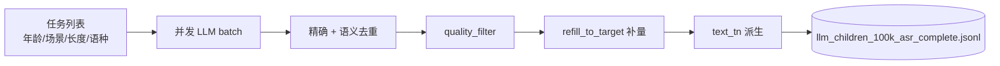

# 儿童口语文本生成（text_generation）

用 LLM 批量生成带 OmniVoice 非语言标签的儿童口语文本，写入 JSONL 供 `voice_clone/clone_dataset.py` 随机抽样克隆。

## 目录

```
text_generation/
├── README.md                    # 本文档
├── .env                         # LLM API（勿提交 Git）
├── llm_generate_texts.py        # 核心：提示词、采样、去重、质检、并发 worker
├── run_100k_asr_complete.py     # 生产入口：10 万条 ASR 友好完整句
├── text_tn.py                   # 从 text 派生 text_tn（ASR/WER 参考归一化）
└── reprocess_quality.py         # 不重调 LLM，仅重跑质检/去重/补量
```

## 产出

默认输出目录：`batch_generated_text/`（仓库根目录下）

| 文件 | 说明 |
|------|------|
| `llm_children_100k_asr_complete.jsonl` | **最终 10 万条**（克隆脚本读取） |
| `.checkpoint_100k_asr_complete.jsonl` | 生成过程 checkpoint，支持断点续跑 |
| `.raw_before_quality.jsonl` | 质检前原始快照 |

克隆脚本默认读取：

```
batch_generated_text/llm_children_100k_asr_complete.jsonl
```

## 环境配置

在 `text_generation/.env` 或 shell 中设置：

```bash
LLM_MODEL=mimo-v2.5          # 或 deepseek-chat 等
LLM_API_KEY=...
LLM_BASE_URL=https://your-api/v1
```

也支持 `DEEPSEEK_API_KEY`、`ANTHROPIC_API_KEY` 作为 API Key 回退。

### 可选环境变量（`apply_config_from_env`）

| 变量 | 作用 |
|------|------|
| `GEN_TOTAL_TARGET` | 目标条数（默认 100000） |
| `GEN_BATCH_SIZE` | 每次 LLM 请求生成条数 |
| `GEN_MAX_WORKERS` | 并发 worker 数 |
| `GEN_SEED` | 随机种子 |
| `GEN_OUTPUT_DIR` | 输出目录 |
| `GEN_SEMANTIC_DEDUP_THRESHOLD` | 语义去重阈值（默认 0.88） |
| `GEN_MODEL` | 覆盖 `LLM_MODEL` |

`.env` 在 import 时加载，**不会覆盖**已存在的 shell 环境变量。

## 快速开始

```bash
cd batch_generate_text_and_clone/text_generation

# 配置 .env 后
python run_100k_asr_complete.py
```

断点续跑：再次执行同一命令，会从 `.checkpoint_100k_asr_complete.jsonl` 继续未完成的 task。

小规模调试：

```bash
GEN_TOTAL_TARGET=500 GEN_MAX_WORKERS=4 python run_100k_asr_complete.py
```

## 流水线



### `run_100k_asr_complete.py`

生产用包装脚本，相对通用 `llm_generate_texts.main()`：

- `total_target=100000`，`batch_size=10`，`max_workers=10`
- `truncate_overlength=False`（保留完整句，利于 ASR 评测）
- 生成结束后自动：去重 → 质检 → 补量 → 写最终 JSONL

### `llm_generate_texts.py`

核心库，也可直接运行（默认输出 `llm_children_v3.jsonl`）：

```bash
python llm_generate_texts.py
```

主要能力：

- **分层采样**：年龄档（preschool / early_elem / upper_elem）、句长、中英混读比例、场景类型
- **标签约束**：非语言标签位置与密度校验、场景相关 tag 模式
- **去重**：规范化精确去重 + 语义相似度去重
- **质检** `quality_filter`：标签密度、长度类型、严重长度不匹配等
- **补量** `refill_to_target`：不足目标时追加生成
- **text_tn**：可选自动派生（`generate_text_tn=True`）

### `text_tn.py`

从带标签的 `text` 生成 ASR/WER 用参考串 `text_tn`：

1. 去掉 `[laughter]` 等非语言标签
2. 调用 `omnivoice.eval.wer.text_normalize`
3. 清理 CJK 间多余空格

`eval_cer` 使用的是 sidecar 里的原始 `gen_text` + 评测脚本内 ITN，**不直接读 JSONL 的 text_tn**；`text_tn` 主要用于其他 WER 流程或数据分析。

### `reprocess_quality.py`

不调 LLM，仅对已有 raw 快照重跑后处理：

```bash
python reprocess_quality.py \
  --raw .raw_before_quality.jsonl \
  --output-dir /path/to/batch_generated_text \
  --target 100000
```

适用：调整了 `quality_filter` / 去重阈值后，从 raw 快照快速重建 JSONL。

## JSONL 记录格式

每行一条 JSON，LLM 输出 `text` 及元数据；`text_tn` 由代码派生。

```json
{
  "text": "嗯，那个，我要吃饭饭[laughter]",
  "length_type": "short",
  "lang_type": "pure_cn",
  "scenario": "daily_family",
  "subscene": "吃饭挑食讨价还价",
  "emotion": "happy",
  "age_tier": "preschool",
  "language": "zh",
  "text_tn": "嗯那个我要吃饭饭"
}
```

| 字段 | 说明 |
|------|------|
| `text` | 带标签口语，供 TTS 克隆（→ sidecar `gen_text`） |
| `language` | `zh` / `en`，克隆时映射 OmniVoice 语种 |
| `lang_type` | `pure_cn`、`pure_en`、`cn_mostly`、`en_mostly`、`frequent_mix` |
| `length_type` | `ultra_short` … `very_long` |
| `scenario` / `subscene` | 场景与子场景 |
| `age_tier` | 年龄段 |
| `text_tn` | 可选，ASR 参考归一化文本 |

## 与克隆/评测的关系

```
text_generation  →  llm_children_100k_asr_complete.jsonl
       ↓
voice_clone      →  batch_cloned_voices/**/text_*.wav + text_*.json
       ↓
eval_cer         →  CER 报告 + text_*.eval.json
eval_sim         →  相似度报告 + text_*.sim.json
eval_mos         →  质量多指标报告 (UTMOS22Strong/SCOREQ/TTSDS2/UTMOSv2) + text_*.mos.json
```

克隆时每条参考音随机抽 **10 句** JSONL（seed 与 `utt_id` 绑定，可复现）；sidecar 中 `gen_text` 即 JSONL 的 `text` 字段。

## 常见问题

**生成中断怎么办？**  
直接重跑 `run_100k_asr_complete.py`，checkpoint 会跳过已完成 task。

**条数不够 10 万？**  
查看日志里 `Quality reject breakdown`；可调低质检强度或增大 raw 生成量，或用 `reprocess_quality.py` 配合 refill。

**换模型 / API？**  
改 `.env` 中 `LLM_MODEL`、`LLM_BASE_URL`；大规模跑前建议 `GEN_TOTAL_TARGET=100` 试跑。

**勿提交密钥**  
`.env` 仅本地使用，不要加入 Git。

## 上游文档

- 总览：[../README.md](../README.md)
- 克隆：[../voice_clone/README.md](../voice_clone/README.md)
